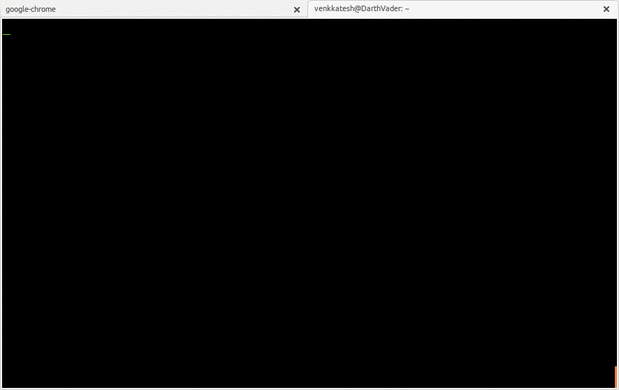

caught
======

Takes pictures when someone enters a wrong password

#####Demo

Instructions
------------
```sh
$	git clone https://github.com/Spockuto/caught
$ 	cd caught
$ 	./install
```
Make the following changes in /etc/pam.d/common-auth

```sh
auth	[success=3 default=ignore]	pam_unix.so nullok_secure
```

Increment the number by 1. Add the following line right under it.

```sh
	auth    [default=ignore]            pam_exec.so seteuid /usr/local/bin/caught
```

Dependencies
------------
[ffmpeg](https://trac.ffmpeg.org/wiki/CompilationGuide/Ubuntu)


